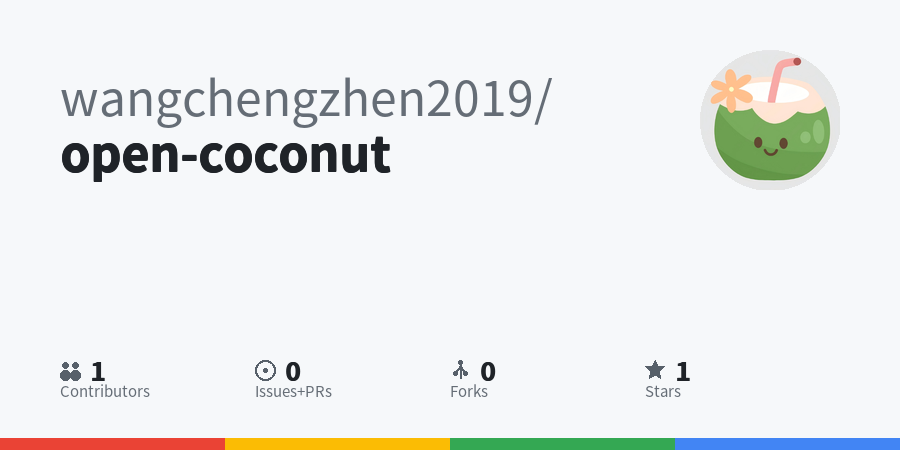

# Open Coconut AI

# Open Coconut AI 项目简介
Open Coconut AI 是一款聚焦 Python 代码优化的人工智能类项目，核心依托StaticAnalysisDriver.py模块实现 Python 代码静态分析与自动化优化，同时关联MicroBit.py模块可对接 Micro:bit 微型开发板相关交互逻辑，由 wangchengzhen2019 开发维护。
其核心能力围绕代码静态分析展开：通过解析代码生成抽象语法树（AST），检测未使用变量、低效循环等代码缺陷，并能基于分析结果自动优化代码（如移除冗余变量、替换低效列表操作），兼具非侵入式分析、自动化优化、易扩展的特性，适用于 Python 代码规范检测、性能优化等场景。项目以Main.py作为核心入口，整体轻量化且聚焦实用的代码优化需求。

